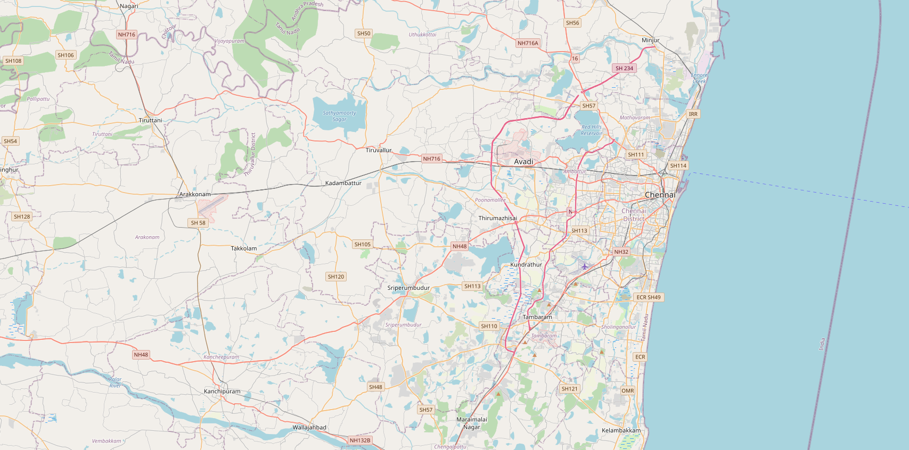
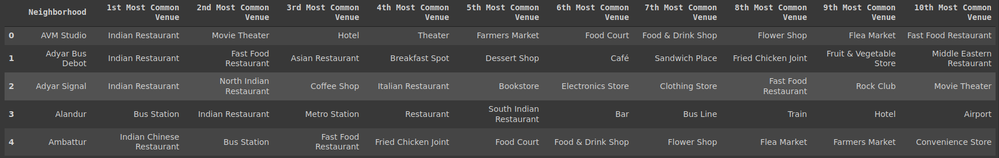
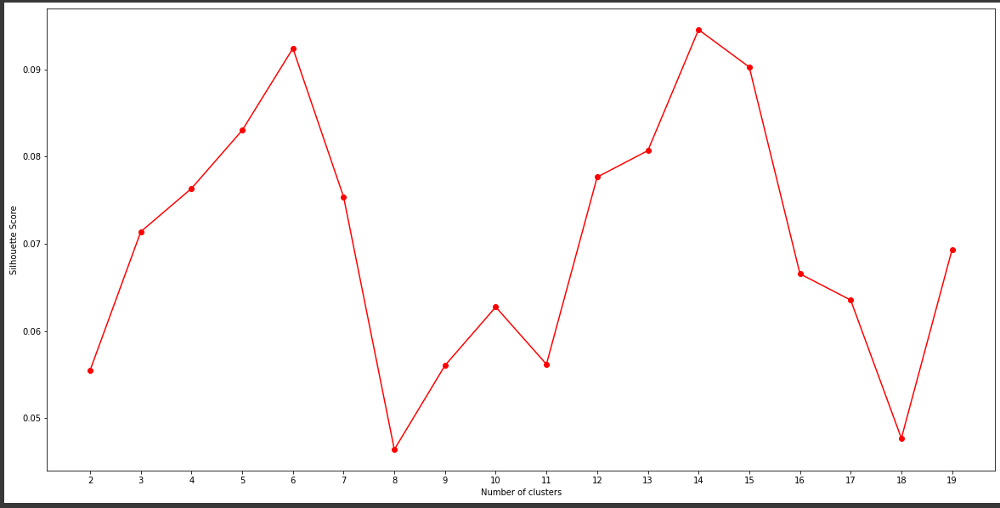
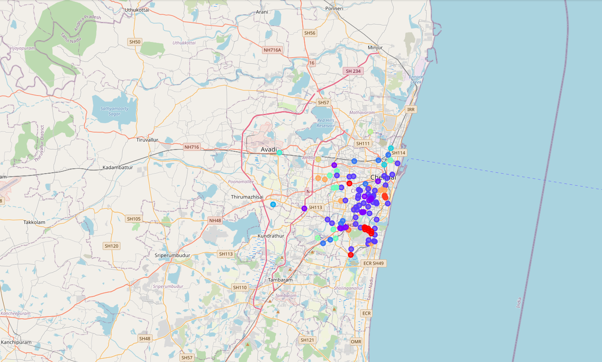
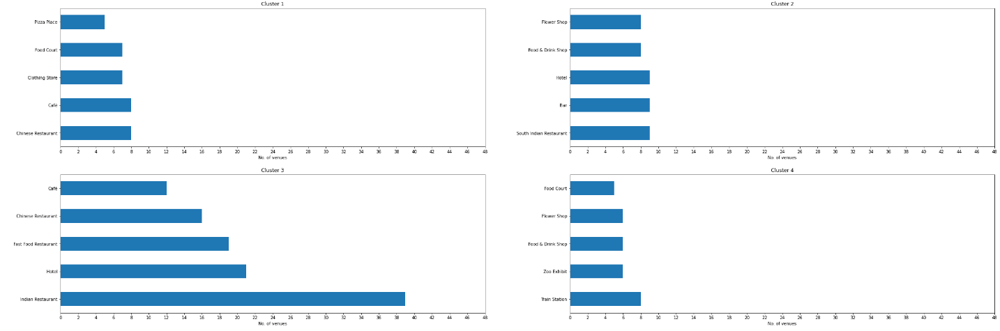
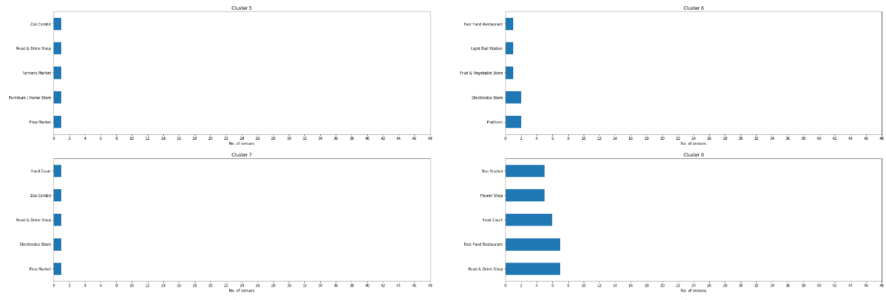
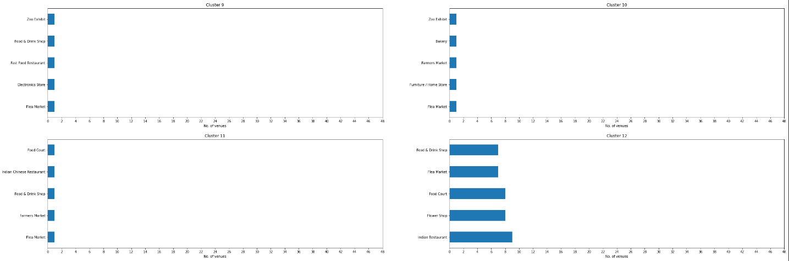
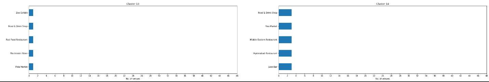

# BattleofNeighborhood

## **Table of contents**

*   [Business understanding](#intro)
*   [Data requirements](#requirements)
*   [Data collection](#collection)
*   [Data visualization](#visual)
*   [Data understanding](#understanding)
*   [Data analytics](#analytics)
*   [Model evaluation](#model)
*   [Result analysis](#result)

## **Business understanding** 

Chennai is one of the largest cultural, economic and educational centres of South India. Chennai's various recreational spots attracts a huge amount of tourists. Considering the mobility across the city being it tourists, college students or office goers, starting a **cafe business** at a right spot will be a great success. 

This project analyses various aspects such as **population density, recreational centers, existing food outlets,** etc. and suggests a right locality for opening a cafe.

## Data requirements 

Various aspects such as **list of areas** in the city, **population distribution**, **recreational spots**, available **restaurants** in each locality, etc. are required for analysing our problem. Let us discuss the collection of these data in the following section.

## Data collection 
The primary data to be collected is list of **latitudes and longitudes** of Chennai city. Let us collect this information from https://chennaiiq.com/chennai/latitude_longitude_areas.asp. We will be using **BeautifulSoup** to **scrap** the necessary details from the above link. The processed data will be passed to **Foursquare API** in order to extract further information regarding the localities.

## Data visualization 
**Follium** is used to plot the **geographical data** and visualize the Chennai city. Further **bar graphs** will be used to have a low level visualization later in this project.

  

## Data understanding 

Let's try to understand the available raw data. First let us **group the data** based on the **neighborhood**. Then we shall pick **top 10 common venues** for each neighborhood. By doing so we will get a better clarity on the data distribution. 

  

## Data analytics 
Now that we have grouped the data based on the neighborhood and picked top 10 common venues, we shall further gain some insights by **statistical means**. Since we have **unlabelled data points**, let us use **K-Means clustering algorithm** and try to group these data points to relevant clusters. 

However when it comes to K-Means clustering, it is tricky to choose a right **K-value**. Let us run the clustering for various K values and pick the right value based on the optimal **silhouette score**.

## Model Evaluation 

The model is evaluated by **silhouette metrics** and an optimal **value of K** is chosen.

  

  

## Result Analysis:

It can be observed that clusters 1-4, 8, 11,12 and 14 has quite a high number of food outlets. Though the count seems less in clusters 5,6,7 and 9, it has good number of varieties. It is not be wise to open a cafe in such regions.

In order to avoid heavy competition cluster 10 and 13 shall be considered.
Further analysing it is observed that cluster 10 is highly dense compared to that of cluster 13. Opening a cafe in dense region is highly recommended. 

  

  

  

  

